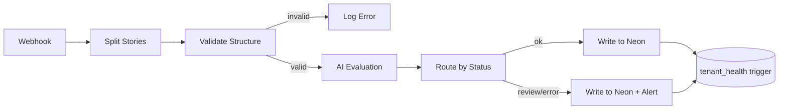

# Automated Story QA Pipeline
### AI Product Operations — Take-Home Task
**Storyteller — Phase 2 Submission**
Vaughn Botha | 13 March 2026

---

## 1. What Storyteller Actually Is

Storyteller is a B2B SDK platform. Sports leagues, media brands, and apps buy Storyteller and embed the Stories and Clips experience inside their own platforms. End users never see the Storyteller brand. Tenants are Storyteller's customers.

This matters because the quality problem is not just whether individual stories are well-made. It is whether a tenant's publishing health is degrading — and Storyteller currently has limited visibility into what is happening inside each tenant's CMS after the SDK is deployed. That is the real operational gap.

---

## 2. The Real Problem

Once the SDK is deployed, what does Storyteller know about what its tenants are publishing? Almost nothing, unless something breaks badly enough for a tenant to complain.

The task frames this as a story quality problem. It is actually a **tenant health monitoring problem**. Quality signals per story are the mechanism. Tenant health over time is the product value.

The specific failure mode that makes this urgent: a tenant publishes a story where the CTA says "Buy tickets" but the link points to `/highlights`. An end user taps it, lands on the wrong page, and bounces. The tenant's editor did not catch it. Storyteller had no signal. The trust damage is invisible until it shows up in engagement metrics.

The system built here catches that automatically, logs it, and accumulates it into a tenant-level pattern over time.

---

## 3. What We Are Building

An automated Story QA pipeline that:

- Receives story data via a webhook trigger
- Validates structural integrity without AI (fast and cheap)
- Evaluates coherence and quality using Claude AI for stories that pass validation
- Writes structured results to a Neon (PostgreSQL) database
- Aggregates issues into a tenant health table via a database trigger
- Alerts on flagged stories
- Returns results to a simple HTML frontend that serves as the demo interface

The pipeline runs automatically and repeatedly from the data. It is not a one-off analysis and it is not a purely conceptual solution.

---

## 4. What We Are Deliberately Not Building

| Not Building | Why |
|---|---|
| Video / image analysis | Adds latency and cost at the wrong layer. The structured metadata already carries most of the coherence signal needed. |
| Composite quality score | A weighted formula like `0.4 x content + 0.3 x CTA` produces a number nobody can defend or act on. Specific, named issues are more actionable than a score of 72. |
| Automated moderation decisions | QA surfaces signals. It does not replace editors. Automating moderation decisions creates liability and erodes editorial trust. |
| Multi-agent reviewer chains | Four AI reviewers producing partially conflicting outputs that get averaged together degrades signal quality. One precise, well-prompted evaluation is more reliable. |
| Raw payload inbox table | In production this would be the first write — store the raw event before processing so nothing is lost if the pipeline breaks. Omitted here for time. Called out in future extensions. |
| Full dashboard UI | A populated Neon results table is the output for this prototype. A dashboard is the logical next build with engineering support. |

---

## 5. Tech Stack

| Tool | Role |
|---|---|
| n8n | Workflow automation. Runs the QA pipeline. Handles webhook ingestion, story splitting, validation, AI calls, routing, and alerting. |
| Claude API | AI evaluation layer. One HTTP call per story. Returns structured JSON with issues, status, confidence, and summary. |
| Neon (PostgreSQL) | Persistent data layer. Stores QA results and tenant health aggregations. Database trigger keeps `tenant_health` in sync automatically. |
| HTML frontend | Single-file input and output interface. Paste JSON payload, submit, results render on the same page. Used for demo and submission. |
| GitHub | Source of truth for the n8n workflow JSON exports, HTML frontend, SQL schema, and README writeup. |

---

## 6. n8n Workflow — Main QA Pipeline

Six nodes. Each does exactly one thing. Complexity lives in the prompt, not the node count.

```
Webhook → Split Stories → Validate Structure → AI Evaluation → Route by Result → Write to Neon + Alert
```

---

### Node 1 — Webhook Trigger

**Endpoint:** `POST /story-qa`

Receives the tenant payload. Accepts the full JSON structure including `tenant_id`, `tenant_name`, `last_synced_at`, and the `stories` array. No transformation at this stage.

---

### Node 2 — Split Stories

Item Lists node. Splits the `stories` array into individual items. Each story flows through the rest of the pipeline independently. This is how the system scales — n8n handles concurrency natively and each story is a separate execution.

---

### Node 3 — Structural Validation (Code Node, No AI)

Fast, deterministic checks before any AI call is made. This gate eliminates unnecessary API spend on broken data.

**Checks performed:**
- `story_title` exists and is not empty
- `pages` array has at least one item
- Each page has an `asset_url`
- Each `action` object has both a `cta` field and a `url` field

**If validation fails:** story is flagged as `status: invalid_structure`, written to Neon, and the AI evaluation is skipped entirely.

---

### Node 4 — AI Evaluation (HTTP Request to Claude API)

One API call per story. The prompt is the core of the system.

**Prompt:**

```
You are a Story QA reviewer for a media publishing platform.

A Story contains pages. Each page has a media asset and an action
with a CTA label and a destination URL.

Evaluate this story and return a JSON object only — no prose.

Check:
1. CTA coherence: does the CTA text make sense given the URL path?
   ("Buy tickets" -> /highlights is a mismatch.)
   ("Watch highlights" -> /match-report is coherent.)
2. Title alignment: does the story title match the categories?
3. Page completeness: are any required fields missing or empty?

Return:
{
  "story_id": "",
  "issues": [
    {
      "type": "cta_mismatch",
      "page": "page_2",
      "detail": "one sentence explanation"
    }
  ],
  "status": "ok" | "review" | "invalid",
  "confidence": "high" | "medium" | "low",
  "summary": "one sentence"
}

Story data:
{{story_json}}
```

The CTA mismatch example in the prompt is taken directly from `story_123` in the provided sample data. "Buy tickets" linking to `/highlights` is the live example. This is intentional — it shows the evaluator has read and understood the actual data.

---

### Node 5 — Route by Result (IF / Switch Node)

Routes each story result to the appropriate path based on `status`:

- `status: ok` — write to Neon only
- `status: review` — write to Neon and trigger alert
- `status: invalid` or `invalid_structure` — write to Neon and trigger alert

---

### Node 6 — Write to Neon + Alert

Writes the QA result as a row in `story_qa_results`. For flagged stories, sends a Slack message or email containing the `story_id`, tenant, status, and issues list.

---

## 7. n8n Error Handling Flow

Every critical node (AI call, Neon write) has "Continue on Error" enabled. A dedicated Error Handler node catches any failure.

**When an error occurs:**
- The error handler writes a row to `story_qa_results` with `status: error` and the error message in the `error_message` column
- An alert fires with the `story_id`, tenant, which node failed, error message, and timestamp

Nothing disappears silently. The system is honest about its own operational state. An ops team can see at a glance whether stories are failing to evaluate and why.

The system distinguishes between three outcomes: clean pass, flagged issue, and processing error.

---

## 8. Neon Database Schema

### Table 1 — story_qa_results

```sql
CREATE TABLE story_qa_results (
  id              SERIAL PRIMARY KEY,
  story_id        TEXT NOT NULL,
  tenant_id       TEXT NOT NULL,
  tenant_name     TEXT,
  status          TEXT NOT NULL,
  confidence      TEXT,
  issues          JSONB,
  summary         TEXT,
  error_message   TEXT,
  evaluated_at    TIMESTAMPTZ DEFAULT NOW()
);
```

The `error_message` column is null for successful evaluations and populated on failures. All outcomes live in a single table — no separate error log needed.

---

### Table 2 — tenant_health

```sql
CREATE TABLE tenant_health (
  id               SERIAL PRIMARY KEY,
  tenant_id        TEXT NOT NULL,
  tenant_name      TEXT,
  issue_type       TEXT NOT NULL,
  occurrence_count INT DEFAULT 1,
  first_seen_at    TIMESTAMPTZ DEFAULT NOW(),
  last_seen_at     TIMESTAMPTZ DEFAULT NOW(),
  UNIQUE(tenant_id, issue_type)
);
```

---

### Database Trigger — Auto-populate tenant_health

This trigger fires automatically on every insert into `story_qa_results`. n8n does not need to know it exists. The analytics layer operates independently of the pipeline layer.

```sql
CREATE OR REPLACE FUNCTION update_tenant_health()
RETURNS TRIGGER AS $$
DECLARE
  issue JSONB;
BEGIN
  IF NEW.issues IS NOT NULL THEN
    FOR issue IN SELECT * FROM jsonb_array_elements(NEW.issues)
    LOOP
      INSERT INTO tenant_health
        (tenant_id, tenant_name, issue_type, occurrence_count,
         first_seen_at, last_seen_at)
      VALUES
        (NEW.tenant_id, NEW.tenant_name,
         issue->>'type', 1, NOW(), NOW())
      ON CONFLICT (tenant_id, issue_type)
      DO UPDATE SET
        occurrence_count = tenant_health.occurrence_count + 1,
        last_seen_at = NOW();
    END LOOP;
  END IF;
  RETURN NEW;
END;
$$ LANGUAGE plpgsql;

CREATE TRIGGER trg_update_tenant_health
AFTER INSERT ON story_qa_results
FOR EACH ROW EXECUTE FUNCTION update_tenant_health();
```

Over time `tenant_health` answers: which tenants have recurring CTA problems, which issue types are systemic versus one-off, and which tenants are getting worse not better. This is data a customer success team can act on without querying raw results.

---

## 9. n8n Results Retrieval Webhook

A second n8n workflow exposes a simple read endpoint for the HTML frontend.

**Endpoint:** `GET /story-qa-result?story_id=story_123`

**Node sequence:**
1. Webhook receives request with `story_id` query parameter
2. Neon node queries `story_qa_results WHERE story_id = {{query.story_id}} ORDER BY evaluated_at DESC LIMIT 1`
3. Respond to Webhook node returns the row as JSON

The HTML frontend polls this endpoint every 2 seconds after submitting a payload, until a result appears for the submitted `story_id`. This handles variable n8n execution time cleanly and is more reliable than a fixed delay.

---

## 10. HTML Frontend

### Purpose

Single-file input and output interface. Paste JSON payload into the textarea, submit, results render on the same page. Included in the GitHub repository as a functional deliverable.

### Layout

Two panels side by side on desktop, stacked on mobile.

**Left panel:**
- Textarea pre-filled with the example story JSON payload
- Submit button
- Clear instruction: "Paste a story payload and submit to run QA"

**Right panel:**
- Results area
- Spinner and "Evaluating..." while polling
- On result: story ID and tenant name at top, status badge, confidence level, list of issues with page reference and detail, summary sentence, evaluated timestamp

### Status Badges

| Status | Style |
|---|---|
| `ok` | Green badge. No issues detected. |
| `review` | Amber badge. Issues found, editor attention recommended. |
| `invalid` / `error` | Red badge. Structural failure or pipeline error. |

### Design Principles

- Clean and minimal. No framework. Vanilla HTML, CSS, and JavaScript in a single file.
- The result panel should feel like a QA report, not a raw JSON dump.
- Pre-fill the textarea with the Antarctic Football League example data so the demo runs immediately.
- Polling feedback: show "Evaluating..." with a subtle spinner so the user knows the system is working.
- Dark background, white card panels, monospace font for the JSON textarea, sans-serif for the results panel.

---

## 11. GitHub Repository Structure

```
storyteller-story-qa/
├── README.md                              ← The writeup. This is a deliverable.
├── workflow/
│   ├── story_qa_pipeline.json             ← n8n main workflow export
│   └── story_qa_results_webhook.json      ← n8n results retrieval workflow export
├── database/
│   └── schema.sql                         ← Full Neon schema with trigger
├── frontend/
│   └── index.html                         ← Single-file HTML interface
└── sample-data/
    └── antarctic_football_league.json     ← Example payload used in demo
```

Every file in the repository is a functional artefact, not documentation of a concept. Someone should be able to clone this repo, import the n8n workflows, run the SQL, open the HTML file, and have a working pipeline.

---

## 12. README — Structure and Content

The README is the written submission. It should read like a clear operational design document, not a technical spec. Audience is the Storyteller team, not an engineer.

### Section 1 — The Problem (2 paragraphs)
Reframe the problem as tenant health monitoring, not story quality scoring. Explain the specific failure mode: CTA mismatch, invisible trust damage, no signal until engagement drops.

### Section 2 — What I Built (1 paragraph + flow diagram)
Plain English description of the pipeline. Webhook receives story data, structural checks filter out broken inputs, AI evaluates coherence and flags issues, results are stored and accumulated into tenant patterns over time.

Include a simple Mermaid flow diagram:



### Section 3 — The Demo
Reference the Remotion video. Show `story_123` being flagged (CTA mismatch on page 2) and `story_124` passing cleanly. The contrast matters.

### Section 4 — Why I Made These Decisions
- No composite score — specific issues are more actionable than a number
- No multi-agent reviewer chain — one precise evaluation beats four noisy ones
- Tenant health table via database trigger — analytics layer is decoupled from pipeline
- Structural validation before AI — eliminates API spend on invalid data

### Section 5 — What I Would Not Build Yet
Video and image analysis, automated moderation decisions, multi-agent reviewer chains. One paragraph each explaining why.

### Section 6 — What I Would Build First With Engineering Support
- Raw payload inbox table — write the event before processing so nothing is lost on pipeline failure
- Tenant health dashboard — the `tenant_health` table is already populated, it needs a UI
- Pre-publish guardrail mode — same pipeline logic runs inside the CMS before a story goes live
- CMS feedback loop — surface QA results directly to the editor who published the story

### Section 7 — How This Shows Up in the Product Over Time
This starts as an ops monitoring tool. Over time the `tenant_health` data becomes the foundation for proactive customer success: which tenants need training, which tenants are publishing at high volume with consistently clean output. Eventually the QA signal feeds back into the CMS itself as a pre-publish guardrail.

---

## 13. Exporting n8n Workflows to GitHub

In n8n: open each workflow, click the three-dot menu, select Download. This exports the workflow as a `.json` file. Rename to the filenames in the repo structure and commit.

The exported JSON contains the full workflow definition including all nodes, connections, credential references (not credential values), and settings.

**Do not include credential values in the export.** The README should document which credentials need to be configured:
- Claude API key
- Neon connection string
- Slack webhook URL (optional, for alerts)

---

## 14. Demo Flow for Remotion Video

Target: under 90 seconds.

1. Open the HTML frontend. The textarea is pre-filled with the Antarctic Football League payload.
2. Point out the CTA mismatch in the JSON: `page_2` has "Buy tickets" linking to `/highlights`.
3. Hit Submit. Show the spinner and "Evaluating..." state.
4. Results appear. `story_123` shows Review status, amber badge, CTA mismatch issue on `page_2` with detail.
5. Switch to `story_124` payload. Submit. Results show OK status, green badge, no issues.
6. Show the Neon results table with both rows populated.
7. Show the `tenant_health` table with the `cta_mismatch` row for Antarctic Football League, `occurrence_count: 1`.
8. Show the n8n workflow canvas briefly. Six nodes, cleanly labelled.

---

## 15. Future Extensions

| Extension | Description |
|---|---|
| Raw payload inbox | Write the raw event to Neon before the pipeline runs. Enables full replay if the pipeline fails. First production hardening step. |
| Tenant health dashboard | The `tenant_health` table is already populated. A read interface for the Storyteller customer success team is the next logical build. |
| Pre-publish guardrail | Same pipeline logic runs inside the CMS before publish, not after. Editors see QA issues before the story goes live. |
| CMS feedback loop | QA results surface directly to the editor who published the story. Closes the feedback loop between ops monitoring and content creation. |
| URL validation | HTTP HEAD check on each action URL. Catches broken links the AI cannot detect from metadata alone. |
| Issue-based tenant recommendations | As `tenant_health` accumulates data, patterns can be used to generate tenant-specific training or onboarding recommendations. |

---

## 16. Assumptions

- Stories are available as structured JSON matching the example payload format
- Media URLs and action URLs are accessible for potential future validation
- The pipeline runs post-publish in this prototype. Pre-publish is a future extension.
- n8n is self-hosted or cloud. Credentials are configured outside the workflow export.
- Neon connection is a standard PostgreSQL connection string.
- Slack alerting is optional. Email can substitute if Slack is not available.

---

*Vaughn Botha | 13 March 2026 | Storyteller AI Product Operations*
